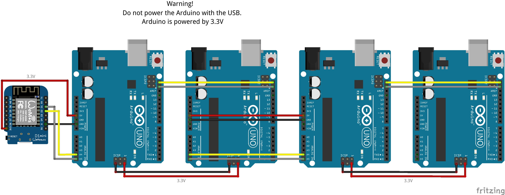
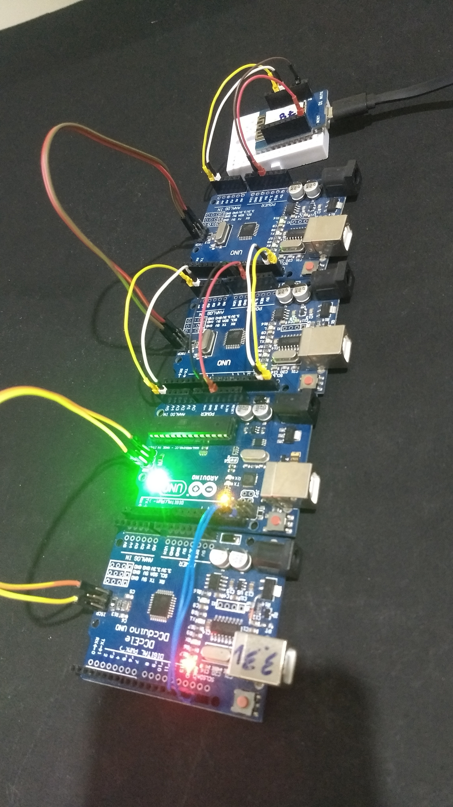
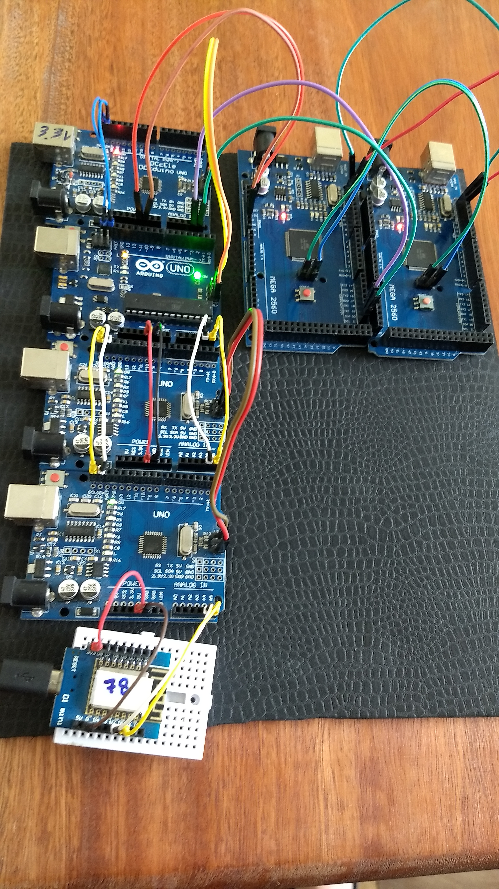

# DuinoCoinI2C

This project design to mine [Duino-Coin](https://github.com/revoxhere/duino-coin) using an Esp8266 as a master and Arduino as a slave. 

Using the I2C communication to connect all the boards and make a scalable communication between the master and the slaves.

<a href="Resources/Fritzing">

</a>

<h3>WARNING: Do not connect the USB of the Arduino, all the boards are powered by 3.3V.</h3>

## Pinouts

Connect the pins of the Esp8266 on the Arduino like the table below.

|| ESP8266 | Arduino |
|:-:| :----: | :-----: |
||3.3V | 5V |
||GND | GND |
|`SCL`|D1 (GPIO5) | A5 |
|`SDA`|D2 (GPIO4) | A4 |

# Library Dependency

* [DuinoCoin](https://github.com/ricaun/arduino-DuinoCoin) (Handle the `Ducos1a` hash work)
* [ArduinoUniqueID](https://github.com/ricaun/ArduinoUniqueID) (Handle the chip ID)
* [StreamJoin](https://github.com/ricaun/StreamJoin) (StreamString for AVR)

# Arduino

All Slaves have the same code and should select the I2C Address automatically.

## Automatic I2C Address 

The I2C Address on the Arduino is automatically updated when the board starts, if an Address already exists on the I2C bus the code finds another Address to use.

# Esp8266

The master requests the job on the `DuinoCoin` server and sends the work to the slave (Arduino).

After the job is done, the slave sends back the response to the master (Esp8266) and then sends back to the `DuinoCoin` server.

## Max Client/Slave

The code supports 10 clients and can be changed on the define:

```
#define CLIENTS 10
```

# Tests

`At the moment the code was tested with 6 clients/slaves at the same time.`




---

Do you like this project? Please [star this project on GitHub](https://github.com/ricaun/DuinoCoinI2C/stargazers)!