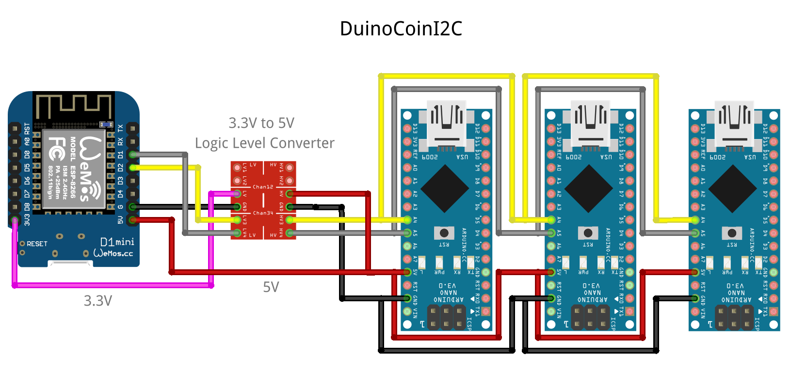
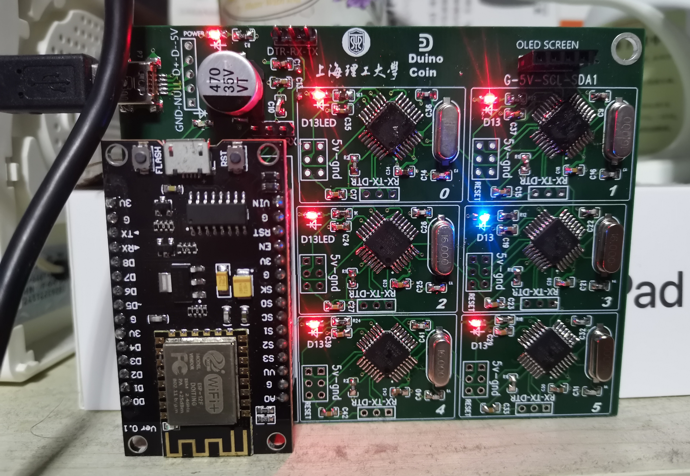

# DuinoCoinI2C


This project design to mine [Duino-Coin](https://github.com/revoxhere/duino-coin) using an Esp8266/Esp32 as a master and Arduino as a slave. 

Using the I2C communication to connect all the boards and make a scalable communication between the master and the slaves.

## Version

DuinoCoinI2C -> DuinoCoin Version 2.7.3

# Arduino - Slave

All Slaves have the same code and should select the I2C Address automatically.

## Library Dependency

* [DuinoCoin](https://github.com/ricaun/arduino-DuinoCoin) (Handle the `Ducos1a` hash work)
* [ArduinoUniqueID](https://github.com/ricaun/ArduinoUniqueID) (Handle the chip ID)
* [StreamJoin](https://github.com/ricaun/StreamJoin) (StreamString for AVR)

## Automatic I2C Address 

The I2C Address on the Arduino is automatically updated when the board starts, if an Address already exists on the I2C bus the code finds another Address to use.

# Tiny - Slave

Tiny Slaves have the same code and the I2C Address is selected by the EEPROM.

## Library Dependency
* [ArduinoUniqueID](https://github.com/ricaun/ArduinoUniqueID) (Handle the chip ID)

## Defines

The code has some defines to make the code smaller and disable some features.

### Serial
This enable the Serial Monitor.

```
#define SERIAL_LOGGER Serial
```

### LED
This enable the led output and makes de led flash when the slave is working.

```
#define LED LED_BUILTIN
```


## Serial set I2C Address 

If the Serial is enable on your mcu, you could send the I2C Address using the Serial Monitor.

## ATtiny85 - ATTinyCore

You could use this code to generate a `ATtiny85` slave using the `http://drazzy.com/package_drazzy.com_index.json` boards on the Arduino IDE. 

Check the [ATTinyCore](https://github.com/SpenceKonde/ATTinyCore/) project for more information.


### I2C pinOut

| pinOut | ATtiny85 |
|:-:| :-----: |
|`SCL`| PB2 |
|`SDA`| PB0 |

### I2C Address 

I2C Address is selected by the `EEPROM_ADDRESS` (default 0) and the first upload the Address is set by the define.

```
#define ADDRESS_I2C 1
```

# Esp8266/Esp32 - Master

The master requests the job on the `DuinoCoin` server and sends the work to the slave (Arduino).

After the job is done, the slave sends back the response to the master (Esp8266/Esp32) and then sends back to the `DuinoCoin` server.

## Library Dependency

* [ArduinoJson](https://github.com/bblanchon/ArduinoJson) (Request Pool Version 2.6)
* [ESPAsyncWebServer](https://github.com/me-no-dev/ESPAsyncWebServer) (ESPAsyncWebServer)
    * [ESPAsyncTCP](https://github.com/me-no-dev/ESPAsyncTCP) (ESP8266)
    * [AsyncTCP](https://github.com/me-no-dev/AsyncTCP) (ESP32)
* [SSD1306Wire](https://github.com/ThingPulse/esp8266-oled-ssd1306/) (SSD1306Wire)
    
## Max Client/Slave

The code supports 10 clients and can be changed on the define:

```
#define CLIENTS 10
```

# Connection Pinouts

Connect the pins of the Esp8266 or Esp32 on the Arduino like the table/images below, use a [Logic Level Converter](https://www.sparkfun.com/products/12009) to connect between the ESP and Arduino.

|| ESP8266 | ESP32 | Logic Level Converter | Arduino |
|:-:| :----: | :----: | :-----: | :-----: |
||3.3V | 3.3V | <---> | 5V |
||GND | GND | <---> | GND |
|`SCL`|D1 (GPIO5) | GPIO22 | <---> | A5 |
|`SDA`|D2 (GPIO4) | GPIO21 | <---> | A4 |



## Custom PCB

[ericddm](https://github.com/ericddm) shared this amazing pcb!



---

Do you like this project? Please [star this project on GitHub](https://github.com/ricaun/DuinoCoinI2C/stargazers)!
